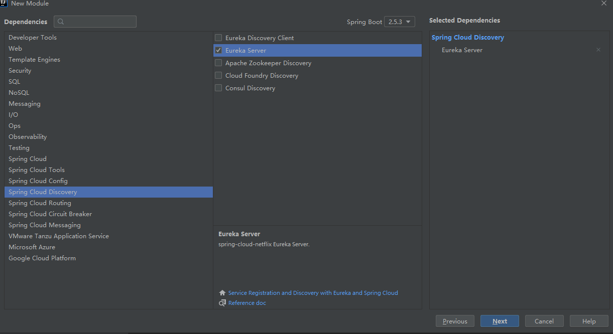
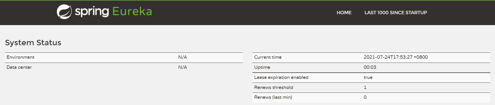
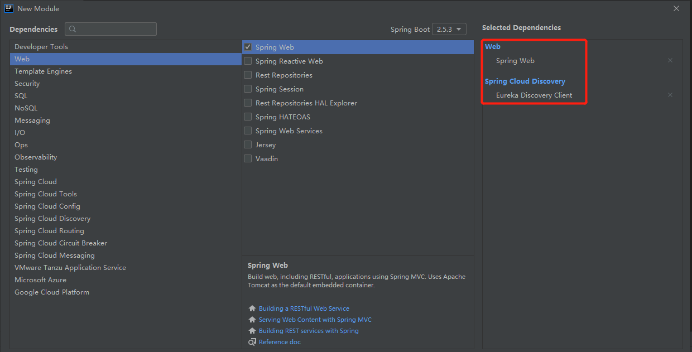
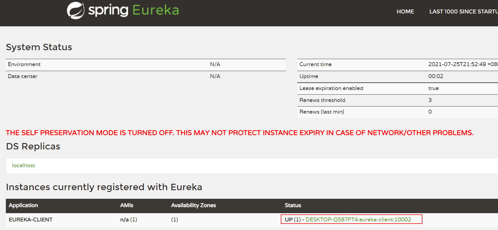
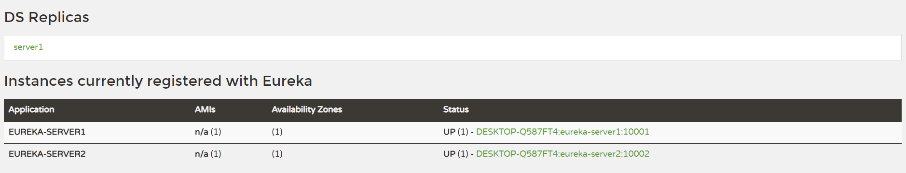
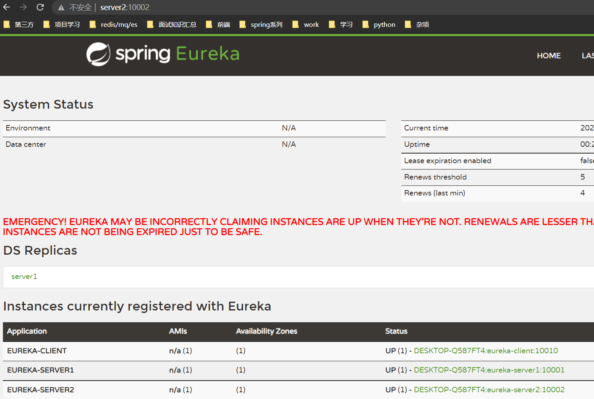
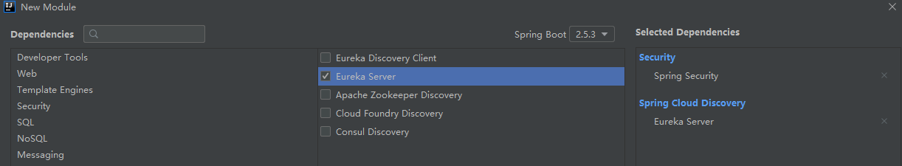

### Spring Cloud Eurake：服务注册与发现

> Spring Cloud Eureka是Spring Cloud Netflix 子项目的核心组件之一，主要用于微服务架构中的服务治理。

在微服务架构中往往会有一个注册中心，每个微服务都会向注册中心去注册自己的地址及端口信息，注册中心维护着服务名称与服务实例的对应关系。每个微服务都会定时从注册中心获取服务列表，同时汇报自己的运行情况，这样当有的服务需要调用其他服务时，就可以从自己获取到的服务列表中获取实例地址进行调用，Eureka实现了这套服务注册与发现机制。

#### 搭建Eureka注册中心

- 创建项目，引入依赖



```xml
<dependency>
    <groupId>org.springframework.cloud</groupId>
    <artifactId>spring-cloud-starter-netflix-eureka-server</artifactId>
</dependency>
```

- @EnableEurekaServer 启动eureka注册中心

```java
@EnableEurekaServer
@SpringBootApplication
public class EurekaServerApplication {

	public static void main(String[] args) {
		SpringApplication.run(EurekaServerApplication.class, args);
	}

}
```

- 配置文件application.yml中添加Eureka注册中心的配置

```yaml
server:
  port: 10001 # 服务运行端口

spring:
  application:
    name: eureka-server # 服务名称
eureka:
  instance:
    hostname: 127.0.0.1 # 指定主机地址
  client:
    fetch-registry: false # 指定是否要从注册中心获取服务（注册中心不需要开启）
    register-with-eureka: false # 指定是否要注册到注册中心（注册中心不需要开启）
  server:
    enable-self-preservation: false # 关闭保护模式
```

- 启动服务，访问http://127.0.0.1:10001/ 进入eureka注册中心界面



#### 搭建Eureka客户端

- 新建eureka客户端模块，引入客户端依赖和spring web依赖



- 引入依赖

```xml
<dependency>
	<groupId>org.springframework.boot</groupId>
	<artifactId>spring-boot-starter-web</artifactId>
</dependency>
<dependency>
	<groupId>org.springframework.cloud</groupId>
	<artifactId>spring-cloud-starter-netflix-eureka-client</artifactId>
</dependency>
```

- 启动类上添加注解@EnableDiscoveryClient，开启客户端的自动配置

```java
@EnableEurekaClient
@SpringBootApplication
public class EurekaClientApplication {

	public static void main(String[] args) {
		SpringApplication.run(EurekaClientApplication.class, args);
	}

}
```

- 配置文件添加eureka客户端配置

```yaml
server:
  port: 10002 # 服务端口号

spring:
  application:
    name: eureka-client # eureka 客户端服务名称

eureka:
  client:
    register-with-eureka: true # 注册到eureka的注册中心
    fetch-registry: true # 获取注册列表实例
    service-url:
      defaultZone: http://localhost:10001/eureka/ # 配置注册中心地址
```

- 启动eureka客户端，在eureka注册中心注册成功



#### 搭建Eureka注册中心集群

>由于所有服务都会注册到注册中心去，服务之间的调用都是通过从注册中心获取的服务列表来调用，注册中心一旦宕机，所有服务调用都会出现问题。所以我们需要多个注册中心组成集群来提供服务，下面将搭建一个双节点的注册中心集群。

- 给eureka-server添加配置文件application-server1.yml 配置一个注册中心

```yaml
server:
  port: 10001 # 服务运行端口

spring:
  application:
    name: eureka-server1 # 服务名称
eureka:
  instance:
    hostname: server1 # 指定主机地址
  client:
    fetch-registry: true # 指定是否要从注册中心获取服务（注册中心不需要开启）
    register-with-eureka: true # 指定是否要注册到注册中心（注册中心不需要开启）
    service-url:
      defaultZone: http://server2:10002/eureka/ #注册到另一个Eureka注册中心
```

- 配置另外一个配置文件application-server2.yml

```yaml
server:
  port: 10002 # 服务运行端口

spring:
  application:
    name: eureka-server2 # 服务名称
eureka:
  instance:
    hostname: server2 # 指定主机地址
  client:
    fetch-registry: true # 指定是否要从注册中心获取服务（注册中心不需要开启）
    register-with-eureka: true # 指定是否要注册到注册中心（注册中心不需要开启）
    service-url:
      defaultZone: http://server1:10001/eureka/ #注册到另一个Eureka注册中心
```



- 修改eureka客户端的配置

```yaml
server:
  port: 10010 # 服务端口号

spring:
  application:
    name: eureka-client # eureka 客户端服务名称

eureka:
  client:
    register-with-eureka: true # 注册到eureka的注册中心
    fetch-registry: true # 获取注册列表实例
    service-url:
      defaultZone: http://server1:10001/eureka/,http://server2:10002/eureka/ # 配置注册中心地址
```



#### Eureka注册中心添加登录认证

- 创建一个eureka-security-server模块



- 依赖

```xml
<dependency>
	<groupId>org.springframework.boot</groupId>
	<artifactId>spring-boot-starter-security</artifactId>
</dependency>
<dependency>
    <groupId>org.springframework.cloud</groupId>
    <artifactId>spring-cloud-starter-netflix-eureka-server</artifactId>
</dependency>
```

- 编辑application.yml配置文件

```yaml
server:
  port: 10003

spring:
  application:
    name: eureka-security-server
  security:
    user: # 配置SpringSecurity 登陆用户名和密码
      name: root
      password: root

eureka:
  instance:
    hostname: 127.0.0.1
  client:
    fetch-registry: false # 指定是否要从注册中心获取服务（注册中心不需要开启）
    register-with-eureka: false # 指定是否要注册到注册中心（注册中心不需要开启）
```

- 添加SpringSecurity配置类WebSpringSecurityConfig

> 默认情况下添加SpringSecurity依赖的应用每个请求都需要添加CSRF token才能访问，Eureka客户端注册时并不会添加，所以需要配置/eureka/**路径不需要CSRF token。

```java
@EnableWebSecurity
public class WebSecurityConfig extends WebSecurityConfigurerAdapter {
    
    @Override
    protected void configure(HttpSecurity http) throws Exception {
        http.csrf().ignoringAntMatchers("/eureka/**");
        super.configure(http);
    }
}
```


