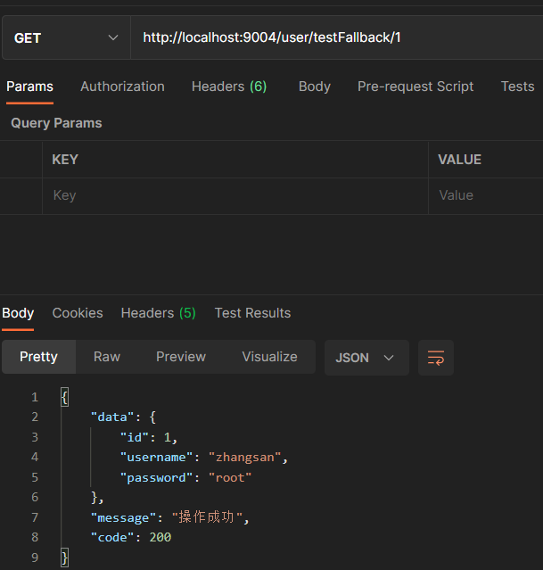
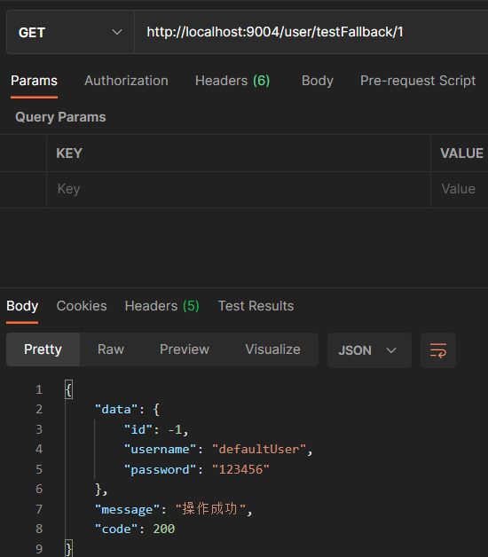
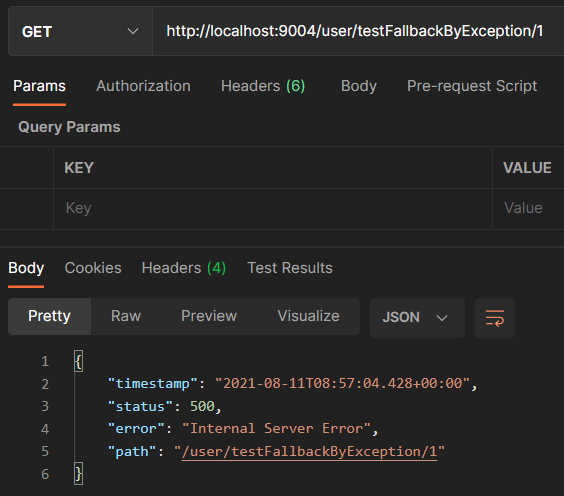
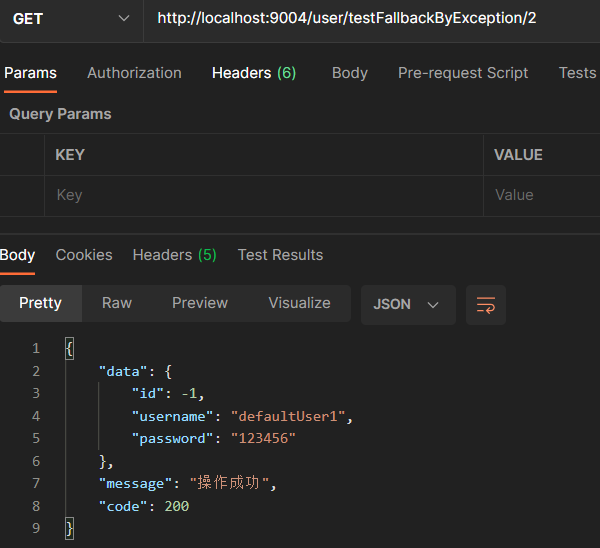
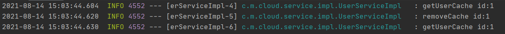

## Spring Cloud Hystrix:  服务容错保护

> Spring Cloud Hystrix 是Spring Cloud Netflix 子项目的核心组件之一，具有服务容错及线程隔离等一系列服务保护功能，本文将对其用法进行详细介绍。

#### 简介

在微服务架构中，服务与服务之间通过远程调用的方式进行通信，一旦某个被调用的服务发生了故障，其依赖服务也会发生故障，此时就会发生故障的蔓延，最终导致系统瘫痪。Hystrix实现了断路器模式，当某个服务发生故障时，通过断路器的监控，给调用方返回一个错误响应，而不是长时间的等待，这样就不会使得调用方由于长时间得不到响应而占用线程，从而防止故障的蔓延。Hystrix具备服务降级、服务熔断、线程隔离、请求缓存、请求合并及服务监控等强大功能。

#### 创建hystrix_service模块

- 添加依赖

```xml
<dependency>
    <groupId>org.springframework.boot</groupId>
    <artifactId>spring-boot-starter-web</artifactId>
</dependency>
<dependency>
    <groupId>org.springframework.cloud</groupId>
    <artifactId>spring-cloud-starter-netflix-eureka-client</artifactId>
</dependency>
<dependency>
    <groupId>org.springframework.cloud</groupId>
    <artifactId>spring-cloud-starter-netflix-hystrix</artifactId>
    <version>2.2.9.RELEASE</version>
</dependency>
<dependency>
    <groupId>org.projectlombok</groupId>
    <artifactId>lombok</artifactId>
    <version>1.18.20</version>
</dependency>
```

- yml配置

```yaml
server:
  port: 9004
spring:
  application:
    name: hystrix-service
eureka:
  client:
    register-with-eureka: true
    fetch-registry: true
    service-url:
      defaultZone: http://localhost:10000/eureka/
service-url:
  user-service: http://user-service

```

- 创建UserHystrixController

```java
@Slf4j
@RestController
@RequestMapping(value ="user")
public class UserHystrixController {

    @Resource
    private UserService userService;

    @GetMapping("/testFallback/{id}")
    public CommonResult testFallback(@PathVariable Long id) {
        CommonResult commonResult = userService.getUser(id);
        log.info("hystrix-service 调用成功！！！");
        return commonResult;
    }


}
```

- 创建UserService和实现类UserServiceImpl

```java
@Service
public class UserServiceImpl implements UserService {

    @Value("service-url.user-service")
    private String userServiceUrl;

    @Resource
    private RestTemplate restTemplate;

    @Override
    @HystrixCommand(fallbackMethod = "getDefaultUser")
    public CommonResult getUser(Long id) {
        return restTemplate.getForObject(userServiceUrl + "/{1}", CommonResult.class, id);
    }

    public CommonResult getDefaultUser(@PathVariable Long id) {
        User defaultUser = new User(-1L, "defaultUser", "123456");
        return new CommonResult<>(defaultUser);
    }
}
```

- 调试

正常



熔断



#### @HystrixCommand详解

- fallbackMethod：指定服务降级处理方法；

- ignoreExceptions：忽略某些异常，不发生服务降级；

- commandKey：命令名称，用于区分不同的命令；

- groupKey：分组名称，Hystrix会根据不同的分组来统计命令的告警及仪表盘信息；

- threadPoolKey：线程池名称，用于划分线程池

ignoreExceptions：忽略某些异常

```java
@HystrixCommand(fallbackMethod = "getDefaultUser1",ignoreExceptions = {NullPointerException.class})
@Override
public CommonResult getUserException(Long id) {
    if(id==1){
        throw new NullPointerException();
    }else if(id==2){
        throw new IndexOutOfBoundsException();
    }
    return restTemplate.getForObject(userServiceUrl + "/user/1", CommonResult.class, id);
}
```

- 参数为1，抛出np异常



- 参数为2，服务降级



####  Hystrix的请求缓存

> 系统并发量越来越大时，我们需要使用缓存来优化系统，达到减轻并发请求线程数，提供响应速度的效果。

##### 相关注解

- @CacheResult：开启缓存，默认所有参数作为缓存key，cacheKeyMethod可以通过返回String类型的方法指定key；

- @CacheKey：指定缓存的key，可以指定参数或者指定参数中的属性作为缓存key，cacheKeyMethod还可以通过返回String类型的方法指定；
- CacheRemove：移除缓存，需要指定commandKey。

**在缓存使用过程中，我们需要在每次使用缓存的请求前后对HystrixRequestContext进行初始化和关闭**

- 添加上下文拦截器HystrixRequestContextServletFilter

```java
@WebFilter(filterName = "hystrixRequestContextServletFilter",urlPatterns = "/*",asyncSupported = true)
public class HystrixRequestContextServletFilter implements Filter {
    @Override
    public void init(FilterConfig filterConfig) throws ServletException {

    }

    @Override
    public void doFilter(ServletRequest servletRequest, ServletResponse servletResponse, FilterChain filterChain) throws IOException, ServletException {
        //初始化Hystrix请求上下文
        HystrixRequestContext context = HystrixRequestContext.initializeContext();
        try {
            //请求正常通过
            filterChain.doFilter(servletRequest, servletResponse);
        } finally {
            //关闭Hystrix请求上下文
            context.shutdown();
        }
    }

    @Override
    public void destroy() {

    }
}
```

##### 测试使用缓存

- controller

```java
@GetMapping("/testCache/{id}")
public CommonResult testCache(@PathVariable Long id) {
    userService.getUserCache(id);
    userService.getUserCache(id);
    userService.getUserCache(id);
    return new CommonResult("操作成功", 200);
}
```

- service

```java
@CacheResult(cacheKeyMethod = "getCacheKey")
@HystrixCommand(fallbackMethod = "getDefaultUser", commandKey = "getUserCache")
@Override
public CommonResult getUserCache(Long id) {
    log.info("getUserCache id:{}", id);
    return restTemplate.getForObject(userServiceUrl + "/user/1", CommonResult.class, id);
}
```

- 结果（调用了三次service打印了一次日志）


##### 测试缓存移除

- controller

```java
@GetMapping("/testRemoveCache/{id}")
public CommonResult testRemoveCache(@PathVariable Long id) {
    userService.getUserCache(id);
    userService.removeCache(id);
    userService.getUserCache(id);
    return new CommonResult("操作成功", 200);
}
```

- service

```java
@CacheRemove(commandKey = "getUserCache", cacheKeyMethod = "getCacheKey")
@HystrixCommand
@Override
public CommonResult removeCache(Long id) {
    log.info("removeCache id:{}", id);
    return restTemplate.getForObject(userServiceUrl + "/user/1", CommonResult.class, id);
}
```

- 结果（打印了三次日志）



#### 全局配置

```yaml
hystrix:
  command: #用于控制HystrixCommand的行为
    default:
      execution:
        isolation:
          strategy: THREAD #控制HystrixCommand的隔离策略，THREAD->线程池隔离策略(默认)，SEMAPHORE->信号量隔离策略
          thread:
            timeoutInMilliseconds: 1000 #配置HystrixCommand执行的超时时间，执行超过该时间会进行服务降级处理
            interruptOnTimeout: true #配置HystrixCommand执行超时的时候是否要中断
            interruptOnCancel: true #配置HystrixCommand执行被取消的时候是否要中断
          timeout:
            enabled: true #配置HystrixCommand的执行是否启用超时时间
          semaphore:
            maxConcurrentRequests: 10 #当使用信号量隔离策略时，用来控制并发量的大小，超过该并发量的请求会被拒绝
      fallback:
        enabled: true #用于控制是否启用服务降级
      circuitBreaker: #用于控制HystrixCircuitBreaker的行为
        enabled: true #用于控制断路器是否跟踪健康状况以及熔断请求
        requestVolumeThreshold: 20 #超过该请求数的请求会被拒绝
        forceOpen: false #强制打开断路器，拒绝所有请求
        forceClosed: false #强制关闭断路器，接收所有请求
      requestCache:
        enabled: true #用于控制是否开启请求缓存
  collapser: #用于控制HystrixCollapser的执行行为
    default:
      maxRequestsInBatch: 100 #控制一次合并请求合并的最大请求数
      timerDelayinMilliseconds: 10 #控制多少毫秒内的请求会被合并成一个
      requestCache:
        enabled: true #控制合并请求是否开启缓存
  threadpool: #用于控制HystrixCommand执行所在线程池的行为
    default:
      coreSize: 10 #线程池的核心线程数
      maximumSize: 10 #线程池的最大线程数，超过该线程数的请求会被拒绝
      maxQueueSize: -1 #用于设置线程池的最大队列大小，-1采用SynchronousQueue，其他正数采用LinkedBlockingQueue
      queueSizeRejectionThreshold: 5 #用于设置线程池队列的拒绝阀值，由于LinkedBlockingQueue不能动态改版大小，使用时需要用该参数来控制线程数

```

#### 实例配置

```yaml
hystrix:
  command:
    HystrixComandKey: #将default换成HystrixComrnandKey
      execution:
        isolation:
          strategy: THREAD
  collapser:
    HystrixCollapserKey: #将default换成HystrixCollapserKey
      maxRequestsInBatch: 100
  threadpool:
    HystrixThreadPoolKey: #将default换成HystrixThreadPoolKey
      coreSize: 10

```

配置文件相关key的说明

```txt
HystrixComandKey对应@HystrixCommand中的commandKey属性；
HystrixCollapserKey对应@HystrixCollapser注解中的collapserKey属性；
HystrixThreadPoolKey对应@HystrixCommand中的threadPoolKey属性。
```

** **
