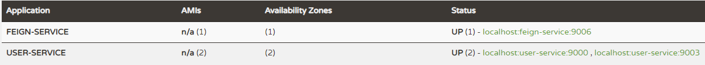
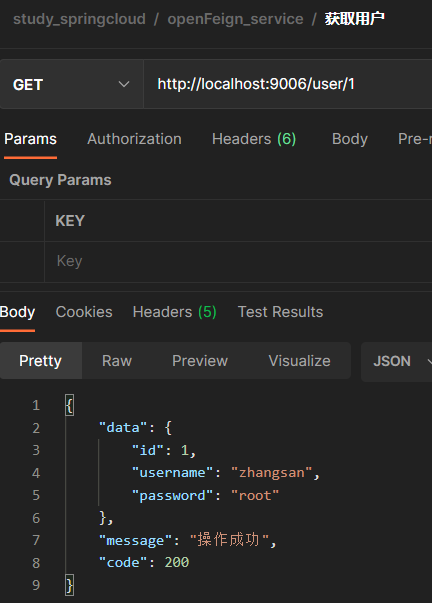
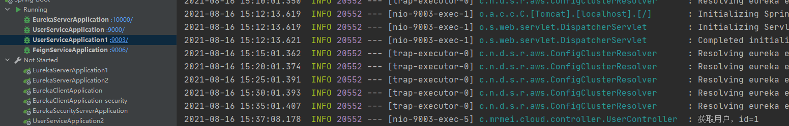
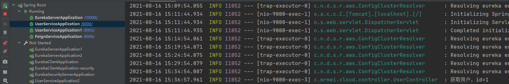

### Spring Cloud OpenFeign：基于Ribbon和Hystrix的声明式服务调用

> Spring Cloud OpenFeign 是声明式的服务调用工具，它整合Ribbon和Hystrix，拥有负载均衡和服务容错功能。

#### Feign简介

Feign是声明式的服务调用工具，我们只需创建一个接口并用注解的方式来配置它，就可以实现对某个服务接口的调用，简化了直接使用RestTemplate来调用服务接口的开发量。Feign具备可插拔的注解支持，同时支持Feign注解、JAX-RS注解及SpringMvc注解。当使用Feign时，Spring Cloud集成了Ribbon和Eureka以提供负载均衡的服务调用及基于Hystrix的服务容错保护功能。

#### 创建一个feign_service模块

- 添加依赖

```xml
<dependency>
    <groupId>org.springframework.cloud</groupId>
    <artifactId>spring-cloud-starter-netflix-eureka-client</artifactId>
</dependency>
<dependency>
    <groupId>org.springframework.cloud</groupId>
    <artifactId>spring-cloud-starter-openfeign</artifactId>
</dependency>
<dependency>
    <groupId>org.springframework.boot</groupId>
    <artifactId>spring-boot-starter-web</artifactId>
</dependency>

```

- yml配置文件

```yaml
server:
  port: 9006
spring:
  application:
    name: feign-service
eureka:
  client:
    register-with-eureka: true
    fetch-registry: true
    service-url:
      defaultZone: http://localhost:10000/eureka/
```

- 启动类上添加@EnableFeignClients注解启动Feign的客户端

```java
@EnableFeignClients
@EnableDiscoveryClient
@SpringBootApplication
public class FeignServiceApplication {

	public static void main(String[] args) {
		SpringApplication.run(FeignServiceApplication.class, args);
	}

}
```

- 添加UserService接口完成对user-service服务的接口绑定

> 我们通过@FeignClient注解实现了一个Feign客户端，其中的value为user-service表示这是对user-service服务的接口调用客户端。我们可以回想下user-service中的UserController，只需将其改为接口，保留原来的SpringMvc注释即可。

```java
@FeignClient("user-service")
public interface UserService {

    @PostMapping("/user/create")
    CommonResult<User> create(@RequestBody User user);

    @GetMapping("/user/{id}")
    CommonResult<User> getUser(@PathVariable("id") Long id);
}
```

- 添加UserFeignController调用UserService实现服务的调用

```java
@PostMapping("/create")
public CommonResult<User> create(@RequestBody User user){
    log.info("创建用户"+user+"成功");
    return new CommonResult<>("操作成功", 200);
}

@GetMapping("/{id}")
public CommonResult<User> getUser(@PathVariable("id") Long id){
    log.info("获取用户，id="+id);
    return new CommonResult<>(new User(id,"zhangsan","root"));
}
```

- 负载均衡结果









####  Fegin服务降级

> Feign中的服务降级使用起来非常方便，只需要为Feign客户端定义的接口添加一个服务降级处理的实现类即可，下面我们为UserService接口添加一个服务降级实现类。

#### 添加服务降级的实现类UserFallbackService

```java
@Component
public class UserFallbackService implements UserService {
    @Override
    public CommonResult<User> create(User user) {
        return new CommonResult<>("创建用户操作成功", 200);
    }

    @Override
    public CommonResult<User> getUser(Long id) {
        User user = new User(-1L, "defaultName", "root");
        return new CommonResult<>(user, "操作成功", 200);
    }
}
```

- 开启Hystrix的配置

```yaml
feign:
  hystrix:
    enabled: true #在Feign中开启Hystrix
```

