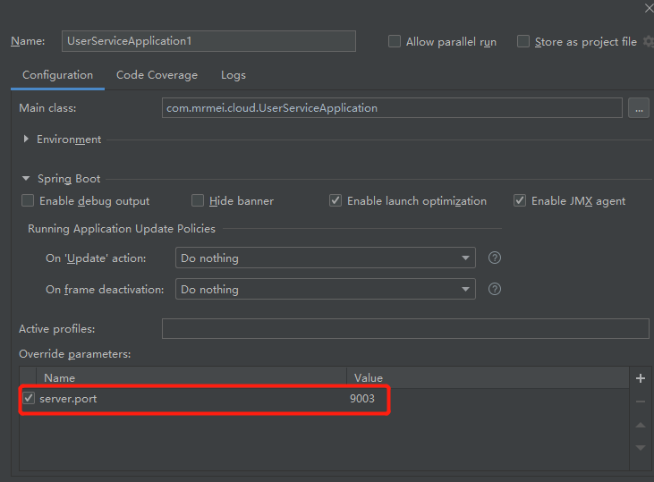
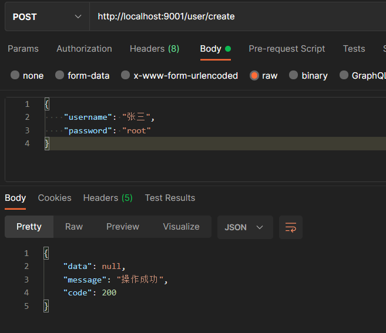
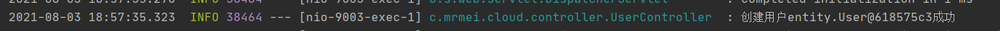

### Spring Cloud Ribbon : 负载均衡的服务调用

> Spring Cloud Ribbon 是Spring Cloud Netflix 子项目的核心组件之一，主要给服务间调用及API网关转发提供负载均衡的功能，本文将对其用法进行详细介绍。

#### Ribbon简介

> 在微服务架构中，很多微服务都会部署多个，其它服务去调用改服务的时候，如何保证负载均衡？负载均衡可以增加系统的可用性和扩展性，当我们使用RestTemplate来调用其它服务，Ribbon可以很方便的实现负载均衡功能。

#### 创建一个user-service模块

user_service 作为被调用服务

- 添加依赖

```xml
<dependency>
    <groupId>org.springframework.boot</groupId>
    <artifactId>spring-boot-starter-web</artifactId>
</dependency>
<dependency>
    <groupId>org.springframework.cloud</groupId>
    <artifactId>spring-cloud-starter-netflix-eureka-client</artifactId>
</dependency>
<dependency>
    <groupId>org.projectlombok</groupId>
    <artifactId>lombok</artifactId>
</dependency>
```

- 添加配置application.yml

```yaml
server:
  port: 9000

spring:
  application:
    name: user-service

eureka:
  client:
    fetch-registry: true
    register-with-eureka: true
    service-url:
      defaultZone: http://localhost:10000/eureka/
```

- 创建用户controller

```java
@Slf4j
@RestController("/user")
public class UserController {

    @PostMapping("/create")
    public CommonResult<User> create(@RequestBody User user){
        log.info("创建用户"+user+"成功");
        return new CommonResult<>("操作成功", 200);
    }

}
```

#### 创建一个ribbon-service模块

- 引入依赖(**eureka自动依赖ribbon**)

```xml
<dependency>
    <groupId>org.springframework.boot</groupId>
    <artifactId>spring-boot-starter-web</artifactId>
</dependency>
<dependency>
    <groupId>org.springframework.cloud</groupId>
    <artifactId>spring-cloud-starter-netflix-eureka-client</artifactId>
</dependency>
<dependency>
    <groupId>org.projectlombok</groupId>
    <artifactId>lombok</artifactId>
    <optional>true</optional>
</dependency>
```

- 添加配置application.yml

```yaml
server:
  port: 9001

spring:
  application:
    name: ribbon_service

eureka:
  client:
    fetch-registry: true
    register-with-eureka: true
    service-url:
      defaultZone: http://localhost:10000/eureka/


service-url:
  user-service: http://user-service
```

#### 使用@LoadBalanced注解赋予RestTemplate负载均衡的能力

- 添加RibbonConfig配置列

```java
@Configuration
public class RibbonConfig {

    @Bean
    @LoadBalanced
    public RestTemplate restTemplate(){
        return new RestTemplate();
    }

}
```

- 添加UserRibbonController

```java
@Slf4j
@RestController
@RequestMapping("/user")
public class UserRibbonController {

    @Autowired
    private RestTemplate restTemplate;

    @Value("${service-url.user-service}")
    private String userServiceUrl;


    @PostMapping("/create")
    public CommonResult create(@RequestBody User user) {
        CommonResult commonResult = restTemplate.postForObject(userServiceUrl + "/user/create", user, CommonResult.class);
        log.info(""+commonResult);
        return commonResult;
    }
}
```

- 启动多个user-service服务



- 调试






#### 常用配置

- 全局配置

```yaml
ribbon:
  ConnectTimeout: 1000 #服务请求连接超时时间（毫秒）
  ReadTimeout: 3000 #服务请求处理超时时间（毫秒）
  OkToRetryOnAllOperations: true #对超时请求启用重试机制
  MaxAutoRetriesNextServer: 1 #切换重试实例的最大个数
  MaxAutoRetries: 1 # 切换实例后重试最大次数
  NFLoadBalancerRuleClassName: com.netflix.loadbalancer.RandomRule #修改负载均衡算法
```

- 指定服务配置

```yaml
user-service:
  ribbon:
    ConnectTimeout: 1000 #服务请求连接超时时间（毫秒）
    ReadTimeout: 3000 #服务请求处理超时时间（毫秒）
    OkToRetryOnAllOperations: true #对超时请求启用重试机制
    MaxAutoRetriesNextServer: 1 #切换重试实例的最大个数
    MaxAutoRetries: 1 # 切换实例后重试最大次数
    NFLoadBalancerRuleClassName: com.netflix.loadbalancer.RandomRule #修改负载均衡算法
```

#### Ribbon负载均衡策略

- com.netflix.loadbalancer.RandomRule：从提供服务的实例中以随机的方式；

- com.netflix.loadbalancer.RoundRobinRule：以线性轮询的方式，就是维护一个计数器，从提供服务的实例中按顺序选取，第一次选第一个，第二次选第二个，以此类推，到最后一个以后再从头来过；

- com.netflix.loadbalancer.RetryRule：在RoundRobinRule的基础上添加重试机制，即在指定的重试时间内，反复使用线性轮询策略来选择可用实例；
- com.netflix.loadbalancer.WeightedResponseTimeRule：对RoundRobinRule的扩展，响应速度越快的实例选择权重越大，越容易被选择；
- com.netflix.loadbalancer.BestAvailableRule：选择并发较小的实例；
- com.netflix.loadbalancer.AvailabilityFilteringRule：先过滤掉故障实例，再选择并发较小的实例；
- com.netflix.loadbalancer.ZoneAwareLoadBalancer：采用双重过滤，同时过滤不是同一区域的实例和故障实例，选择并发较小的实例。
